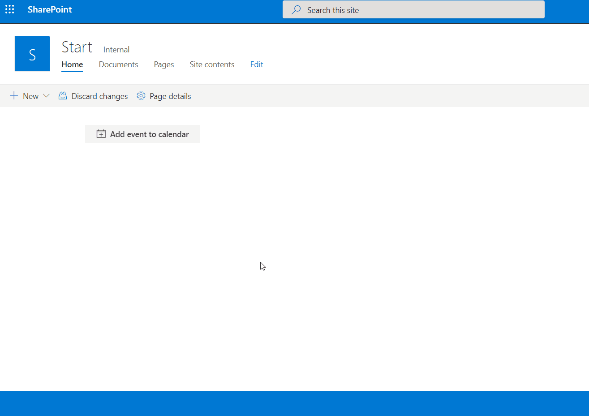

# SharePoint Framework - Download event as ICS file

This solution is created with [SharePoint Framework](https://docs.microsoft.com/en-us/sharepoint/dev/spfx/sharepoint-framework-overview) for SharePoint Online.

This solution demonstrates a example how to enable creating a VCALENDAR (.ics) file for adding events to the users calendar. This is a common requirement in solutions 

### Example



## Getting started

```bash
git clone the repo
npm install
gulp serve
```

## Depoyment and usage

Build the app with:

```bash
gulp bundle --ship
gulp package-solution --ship
```

Enable the app:

1. Upload the file "spfx-webpart-downloadics.sppkg" from  "/sharepoint/solution" to the App Catalog.
2. Go to either a modern Communication or Team Site.
3. Go to "Site contents" and add new "App"
4. Select "spfx-webpart-downloadics" and wait for it to be installed
5. Go to the front page, edit the page and add the "Download ICS file" webpart